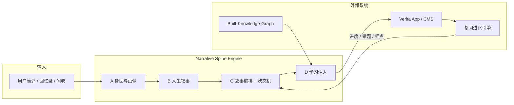
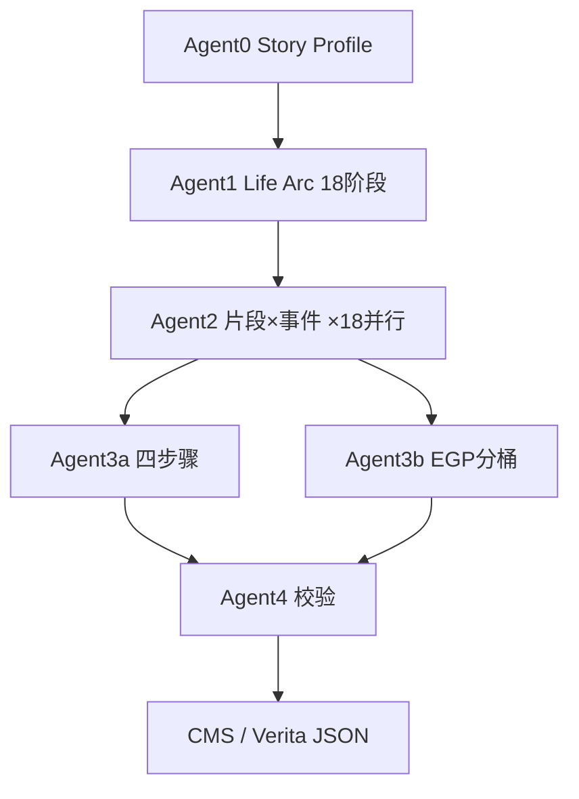
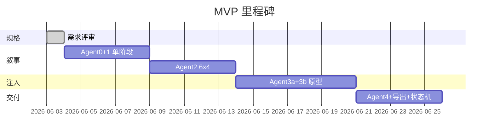

# Narrative Spine Engine — 产品需求规格书

| 字段 | 值 |
|------|-----|
| 文档版本 | v0.1 |
| 状态 | Draft |
| 所属项目 | Built-Courses-Background |
| 关联文档 | `readme.md`、`Agents.Design.md`、`research_pool/v1.md`、`Built-Knowledge-Graph/readme.md` |
| 最后更新 | 2026-06-03 |

---

## 一、产品命题

### 1.1 核心判断

本产品要做的不是「用 AI 生成课程」，而是：

> **用 AI 生成一个持续推进的人生剧本，再把语言学习变成这个剧本里不断解锁未来的关键能力。**

### 1.2 设计原则

| 原则 | 含义 |
|------|------|
| 故事是主轴 | 故事不是包装；用户应感觉「正在经历一条人生路径」，而非「在学一堆散课」 |
| CEFR 是被驱动的 | 语言能力不是独立存在的内容块，而是故事推进中**必须解决**的工具 |
| 故事推进大于语法覆盖 | 叙事连贯性优先于 EGP 点的算术均分 |
| 单元必须有任务感 | 每个学习单元对应明确的戏剧任务与 communicative intent |
| 难度增长要隐性 | 级别跃迁通过故事复杂度自然体现，而非显性「升级提示」 |

### 1.3 与 Verita 的差异

| 维度 | Verita v1（通用课程） | Narrative Spine Engine |
|------|----------------------|------------------------|
| 内容树根节点 | 等级 → 主题（场景） | 人生主线 → 阶段 → 章节 → 事件 |
| 选课动机 | 「我要学 A2-旅行」 | 「我的人生第 N 章」 |
| 语法来源 | 主题内预设要素 | 故事节点推导语言需求后，从 KG 选取 |
| 连续性 | 主题间相对独立 | 同一用户贯穿同一条人生线 |

---

## 二、系统边界

### 2.1 Narrative Spine Engine（叙事脊柱引擎）

**定义**：介于「用户身世输入」与「学习引擎 / App 渲染」之间的**故事驱动学习中枢层**。负责编排人生叙事骨架，并将 CEFR 内容按故事需求注入各节点。

**职责**：

1. 把用户身世、背景、目标转成可推进的人生主线（Life Arc）
2. 把主线拆成阶段、章节、事件、冲突、转折、收束
3. 为每个叙事节点定义「此时此地必须用到的语言能力」
4. 从 CEFR / EGP 知识图谱中选取并绑定语法要素
5. 调度跨章节的知识回收（命运层回响）
6. 维护每个用户的故事状态，确保连续性

**不负责**：

| 范围外 | 归属系统 |
|--------|----------|
| EGP 螺旋排序与质检 | Lab-ConstructingSpiralSyntax |
| 语法知识底座、路径 JSON | Built-Knowledge-Graph |
| 练习题 / Task 渲染与交互 | Verita 学习引擎 |
| 掌握度计算、复习算法 | Verita 复习进化论 |
| 真人对话预约 | Verita 第二闭环（非 MVP） |

### 2.2 系统位置



---

## 三、四层架构

### 3.1 总览

| 层级 | 英文名 | 回答问题 | 主要产出 | 对应 Agent |
|------|--------|----------|----------|------------|
| **A** | Story Profile Layer | 这个人是谁？ | `story_profile.json` | Agent0 |
| **B** | Life Arc Layer | 他未来可能走向哪几条路？ | `life_arc.json` | Agent0（弧）+ Agent1（阶段） |
| **C** | Story Spine Layer | 路拆成哪些章节、冲突、推进节点？ | `story_spine.json` | Agent1 + Agent2 |
| **D** | Language Injection Layer | 每节点插什么 CEFR 内容、怎么插、多深？ | `injection_plan.json` | Agent3a + Agent3b |

### 3.2 A 层 — 身世与画像层（Story Profile）

**输入类型**（支持任意一种或组合）：

| 输入源 | 处理方式 |
|--------|----------|
| 几百字人生简述 | 标准 Story Bible 生成 |
| 结构化问卷（消费观、持之以恒的事等） | 强化 Agent0 第八、九模块 |
| 章节 / 日记导入 | 回忆录锁定，AI 只补结构与虚拟线 |
| 母题子集多选 | 缩小母题调色盘，仍走多米诺 |
| 生辰八字（可选，默认关闭） | 命理推演虚拟未来；需免责声明与叙事边界 |

**必含模块**（对齐 `Agents.Design.md` Agent0）：

- 主角核心人格底色（表层 / 深层驱动 / 矛盾 / 贯穿特质）
- 基本信息、关系网
- 核心人生阶段与多米诺链条
- 核心主线概括、冲突矩阵
- 场景母题（高频 / 关键转折 / 允许范围 / 不建议）
- 叙事边界（时代感 / 语气 / 人物行为）
- 语气、时代感、情绪基调

**语气约束**：朴素、克制、口语化、带文学感；**禁止网文**。

### 3.3 B 层 — 人生叙事层（Life Arc）

**广博（纵向）**：童年 → 学业 → 职业 → 搬家 / 出国 → 社交 → 家庭 → 长期成长线。决定「这条人生故事往哪走」。

**输出**：

- 1 条主 Life Arc（MVP 仅支持单弧）
- 18 个严格线性、环环相扣的人生阶段（`stage_index` 1–18）
- 每阶段：核心冲突、阶段目标、冲突升级点、主动选择、结尾状态变化、主线推进度

**阶段与 CEFR 映射（规格约定）**：

```
18 人生阶段 = 6 CEFR 等级（A1–C2）× 每级 3 个难度档（简单 / 普通 / 困难）
```

| CEFR | 阶段编号 | 难度档标签（示例） |
|------|----------|-------------------|
| A1 | 1–3 | 基础应用 / 熟练应用 / 拓展提升 |
| A2 | 4–6 | … |
| B1 | 7–9 | … |
| B2 | 10–12 | … |
| C1 | 13–15 | … |
| C2 | 16–18 | … |

前端可展示为「A1-基础应用」等任意标签，但引擎内部以 `stage_index` + `cefr_level` + `difficulty_tier` 三元组标识。

### 3.4 C 层 — 故事编排层（Story Spine）

**精微（横向）**：某一天面试、某次租房、某次开会……决定「这一小段故事里要学什么」。

**三层故事结构**：

| 故事层级 | 产品语义 | 结构规格 | 数量（全量） |
|----------|----------|----------|--------------|
| **人生主线** | 为什么学 | Agent1：18 阶段 | 18 |
| **章节事件线** | 什么时候学 | Agent2：每阶段 6 剧情片段 × 4 事件 | 18×6×4 = 432 事件 |
| **任务触发线** | 具体学什么 | Agent3a：每事件 4 步骤 | 432×4 = 1728 步骤 |

**Agent2 关键字段**（每事件必填）：

- `event_title`、`event_summary`
- `language_function`（从固定列表单选，见术语表）
- `cause` / `effect`（多米诺链）
- `communicative_intent`（沟通意图，如：提问、澄清、协商、拒绝）

**连续性约束**：

- 事件间：`events[i].effect` = `events[i+1].cause`
- 片段间：上一片段末事件 `effect` = 下一片段首事件 `cause`
- 阶段间：上一阶段结尾状态 = 下一阶段起始状态
- 禁止网文化、人物降智 / 开挂

### 3.5 D 层 — 学习注入层（Language Injection）

**正确顺序**：故事节点 → 推导语言需求 → 从 KG 查询 egp_id → 绑定到步骤 / Task。

**不负责**「先排课再硬塞故事」。

**Agent 拆分**（解决 readme 中两个 Agent3 重名）：

| Agent | 名称 | 职责 |
|-------|------|------|
| Agent3a | Story Step Engine | 每事件拆 4 步：输入 → 理解 → 语言 → 输出 |
| Agent3b | EGP Bucket Engine | 按故事需求从 KG 有序路径切分 / 选取语法点 |
| Agent4 | Validation Engine | 叙事 + 语法横切校验 |

---

## 四、四层插入机制

语言内容进入故事的方式分为四个层次，**全部需在 `injection_plan` 中可追溯**。

### 4.1 场景层插入（Scene Insertion）

把知识点放进具体场景。

| 字段 | 说明 |
|------|------|
| `scene_motif_id` | 母题 ID（如 `renting_crisis`） |
| `setting` | 时间、地点、氛围 |
| `sample_utterances` | 场景内自然出现的表达（如 Could you…? / How much is the deposit?） |

### 4.2 冲突层插入（Conflict Insertion）

知识点服务故事冲突，而非仅「在课文里出现一次」。

| 触发条件 | 示例 |
|----------|------|
| `language_function` = 触发冲突 | 面试卡住 → 注入「解释经历」「请求重复」 |
| `language_function` = 选择 | 注入条件句、委婉拒绝 |
| `language_function` = 后果 | 注入过去时、因果连接 |

绑定字段：`conflict_type`、`stakes`（代价）、`required_communicative_functions[]`。

### 4.3 能力层插入（Competency Insertion）

同一 `egp_id` 在多种能力任务中反复出现：

| 能力维度 | 对应 Task 类型（Verita） |
|----------|-------------------------|
| 看懂 | 闪卡、选择题（阅读） |
| 听懂 | 多媒体标记、听力选择 |
| 说出 | 口语练习 |
| 改写 | 填空、排序 |
| 迁移 | 新场景 AI 对话 |
| 应用 | 角色扮演、造句 |

字段：`egp_id` + `competency` + `exposure_count`（本事件内第几次出现）。

### 4.4 命运层回收（Destiny Recall）

后续章节重新调出旧知识，形成「回响」。

| 字段 | 说明 |
|------|------|
| `source_event_id` | 首次引入该知识的事件 |
| `recall_event_id` | 回收发生的事件 |
| `recall_mode` | `echo`（原样复现）/ `upgrade`（用法升级）/ `contrast`（对比用法） |
| `min_chapter_gap` | 与首次引入的最小章节间隔 |

由**故事状态机**的 `pending_recycle[]` 调度；Agent4 校验回收覆盖率。

---

## 五、故事状态机（Story State Machine）

故事不是静态文本，而是**每用户一条持续演化的人生线**。

### 5.1 状态对象：`StoryState`

```json
{
  "user_id": "string",
  "story_id": "string",
  "version": 1,
  "created_at": "ISO8601",
  "updated_at": "ISO8601",

  "active_arc_id": "string",
  "story_profile_ref": "story_profile.json#version",

  "progress": {
    "current_stage_index": 1,
    "current_fragment_index": 1,
    "current_event_index": 1,
    "current_step_index": 1,
    "furthest_reached": {
      "stage_index": 1,
      "fragment_index": 1,
      "event_index": 1,
      "step_index": 1
    }
  },

  "narrative_flags": {
    "foreshadows": [
      {
        "flag_id": "string",
        "planted_at_event_id": "string",
        "description": "string",
        "resolved": false,
        "resolve_by_stage_index": 18
      }
    ],
    "relationship_states": [
      {
        "character_id": "string",
        "trust_level": 0,
        "last_changed_at_event_id": "string"
      }
    ],
    "irreversible_choices": [
      {
        "choice_id": "string",
        "made_at_event_id": "string",
        "consequence_summary": "string"
      }
    ]
  },

  "completed": {
    "stages": [],
    "fragments": [],
    "events": [],
    "conflicts": []
  },

  "language_state": {
    "unlocked_egp_ids": [],
    "mastered_egp_ids": [],
    "pending_recycle": [
      {
        "egp_id": "string",
        "introduced_at_event_id": "string",
        "introduced_at_stage_index": 1,
        "recall_due_by_stage_index": 5,
        "recall_mode": "upgrade",
        "priority": 1
      }
    ],
    "cefr_level_ceiling": "A1"
  },

  "injection_overrides": [],

  "sync": {
    "last_lesson_completed_at": "ISO8601",
    "last_review_sync_at": "ISO8601",
    "verita_mastery_snapshot_ref": "optional"
  }
}
```

### 5.2 状态转移规则

| 事件 | 状态变更 |
|------|----------|
| 用户完成某步骤 | `progress.current_step_index++`；解锁对应 `egp_id` 至 `unlocked_egp_ids` |
| 用户完成某事件 | `completed.events` 追加；检查 `narrative_flags` 是否触发 |
| 用户完成某阶段 | `completed.stages` 追加；`cefr_level_ceiling` 可能提升 |
| 复习错题回写 | 根据锚点 `event_id` + `egp_id` 调整 `pending_recycle` 优先级 |
| 推进至回收节点 | 从 `pending_recycle` 弹出项，写入 Agent3a 步骤的「命运层」插入计划 |

### 5.3 状态机职责

1. **禁止每次重讲新故事**：生成内容必须读取当前 `StoryState`
2. **调度命运层回收**：`pending_recycle` 驱动跨章节语法复现
3. **与复习系统对接**：错题锚定在 `event_id` + `egp_id`（对齐 v1 锚点复习法）
4. **支持断点续学**：`furthest_reached` 与 `progress` 分离，允许复习回看

---

## 六、Agent 编排

### 6.1 流水线 DAG



### 6.2 各 Agent 规格索引

| Agent | 规格位置 | MVP 实现要求 |
|-------|----------|--------------|
| Agent0 | `Agents.Design.md` § Agent0 | 写入 `prompts/0_StoryRibleAgent.json`；产出 `story_profile.json` |
| Agent1 | `Agents.Design.md` § Agent1 | 完整版 + 简略版；产出 `life_arc.json` |
| Agent2 | `Agents.Design.md` § Agent2 | 产出 `story_spine.stage_{n}.json` |
| Agent3a | 本文 § 3.5 + § 7.4 | 四步拆解 prompt 待编写 |
| Agent3b | 本文 § 7.5 | 滑动窗口分桶脚本 + prompt |
| Agent4 | 本文 § 8 | 规则引擎 + LLM 辅助 |

### 6.3 门控策略

每一 Agent 输出经 Agent4 子检查后方能进入下一阶段；校验失败则：

1. 生成 `validation_report.json`
2. 自动重试（最多 2 次）或标记人工审阅
3. MVP 阶段：**人工闸门** — 未通过则不可导出 Verita JSON

---

## 七、数据模型

### 7.1 核心 JSON 产物

| 文件 | 层级 | 说明 |
|------|------|------|
| `story_profile.json` | A | Agent0 结构化输出 |
| `life_arc.json` | B | 18 阶段骨架 + 阶段元数据 |
| `story_spine.stage_{n}.json` | C | 单阶段 6 片段 × 4 事件 |
| `story_steps.event_{id}.json` | C/D | 单事件 4 步骤 + 叙事文本 |
| `injection_plan.event_{id}.json` | D | 四层插入计划 + egp_id 列表 |
| `story_state.user_{id}.json` | 运行时 | 故事状态机持久化 |
| `validation_report.json` | 横切 | Agent4 输出 |
| `course_export.verita.json` | 交付 | 对接 Verita CMS 的树状课程 JSON |

### 7.2 `life_arc.json` 阶段对象（摘要）

```json
{
  "stage_index": 1,
  "stage_title": "青年·第一次职场崩塌",
  "cefr_level": "A1",
  "difficulty_tier": "basic",
  "core_conflict": {
    "internal": "string",
    "external": "string"
  },
  "stage_goal": "string",
  "escalation": "string",
  "protagonist_choice": "string",
  "end_state": {
    "capability": "string",
    "relationship": "string",
    "cognition": "string",
    "situation": "string"
  },
  "arc_progress_pct": 6,
  "domino_link": {
    "from_previous": "string",
    "to_next": "string"
  }
}
```

### 7.3 `story_spine` 事件对象（摘要）

```json
{
  "event_id": "s01_f03_e02",
  "stage_index": 1,
  "fragment_index": 3,
  "event_index": 2,
  "event_title": "询问押金条款",
  "event_summary": "string",
  "language_function": "触发冲突",
  "communicative_intent": ["提问", "澄清", "价格协商"],
  "cause": "string",
  "effect": "string",
  "scene_motif_id": "renting_crisis",
  "language_requirements": {
    "cefr_level": "A1",
    "functions": ["礼貌请求", "数字与时间"],
    "notes": "故事推导的自由文本，供 Agent3b 查询"
  }
}
```

### 7.4 Agent3a 四步骤结构

| 步骤 | 名称 | 叙事职责 | Verita 映射 |
|------|------|----------|-------------|
| 1 | 输入 | 故事片段、场景摄入 | 场景摄入 |
| 2 | 理解 | 信息提取、听读辨识 | 关键词汇（部分） |
| 3 | 语言 | 语法 / 句型聚焦 | 语法学习 + 词汇 |
| 4 | 输出 | 模拟对话、产出 | 训练 + AI 场景问答 |

```json
{
  "event_id": "s01_f03_e02",
  "steps": [
    {
      "step_index": 1,
      "step_type": "input",
      "title": "string",
      "narrative": "string",
      "media_hints": []
    },
    {
      "step_index": 2,
      "step_type": "comprehend",
      "egp_ids": [],
      "competency": ["看懂", "听懂"]
    },
    {
      "step_index": 3,
      "step_type": "language",
      "egp_ids": [],
      "competency": ["改写"],
      "insertion_layers": ["scene", "conflict"]
    },
    {
      "step_index": 4,
      "step_type": "output",
      "egp_ids": [],
      "competency": ["说出", "迁移"],
      "ai_dialogue_brief": "string"
    }
  ]
}
```

### 7.5 Agent3b EGP 分桶策略

**原则**：桶 = KG 有序子序列上的连续窗口；**禁止**假设每步固定 2 个语法点。

| 规则 | 说明 |
|------|------|
| 数据源 | `Built-Knowledge-Graph/output/A1_C2_sorted.json`、`output/paths/level_{cefr}.json` |
| 窗口大小 | 每事件 0–4 个新 `egp_id`（按叙事权重） |
| 前置约束 | 尊重 `prerequisites` 链，依赖者优先 |
| 螺旋回顾 | 允许复现已学 `egp_id`，标记 `insertion_layers` 含 `destiny` |
| 缺口显式化 | 输出 `uncovered_egp_ids[]`、`overflow_events[]` 供 Agent4 与产品决策 |

**弱关联（MVP）**：`communicative_intent` + `suggested_super_categories[]` → KG 同等级查询。

**强关联（Post-MVP）**：EGP `examples` / `trigger_lemmas` 与 `event_summary` embedding 匹配。

---

## 八、校验规格（Agent4）

### 8.1 硬规则（代码执行）

| 检查项 | 规则 |
|--------|------|
| 语法超纲 | 事件 `egp_id` 不得超出 `stage.cefr_level` + `difficulty_tier` 允许范围 |
| 重复 | 同一阶段内 `egp_id` 首次引入后，重复须标记为 `destiny` 回收 |
| 难度跳跃 | 相邻事件引入的 `egp_id` 在 KG 路径上不得跨越超过 N 个未学前置（N=5，可配置） |
| 多米诺断裂 | `cause`/`effect` 链自动校验 |
| 必填字段 | `language_function`、`communicative_intent`、`event_id` 唯一性 |

### 8.2 软规则（LLM + Agent0 边界对照）

| 检查项 | 规则 |
|--------|------|
| 故事断裂 | 阶段 / 片段间主角状态是否连贯 |
| 语气漂移 | 是否出现网文化、爽文逻辑 |
| 人物 OOC | 是否违背 `story_profile` 人格底色 |
| 回收覆盖率 | `pending_recycle` 中逾期项是否已安排回收 |

### 8.3 校验报告

```json
{
  "target_ref": "story_spine.stage_01.json",
  "passed": false,
  "hard_errors": [],
  "soft_warnings": [],
  "uncovered_egp_ids": [],
  "suggested_fixes": []
}
```

---

## 九、外部系统集成

### 9.1 Built-Knowledge-Graph

| 用途 | 路径 / API |
|------|------------|
| 全量有序语法点 | `output/A1_C2_sorted.json` |
| 等级内路径 | `output/paths/level_a1.json` … `level_c2.json` |
| 前置依赖 | 图谱 `prerequisites` 字段 |
| 查询 | `step4_query.py` 等级概览、依赖链 |

### 9.2 Verita v1 字段映射

| NSE 概念 | Verita v1 概念 |
|----------|----------------|
| 多媒体课程 | 人生连续剧课包（用户定制 Story Bible） |
| 类别 / 等级 | `stage`（含 `cefr_level` + `difficulty_tier`） |
| 主题 | `fragment`（剧情片段） |
| 课时 | `event`（具体事件） |
| 步骤 | `step`（输入 / 理解 / 语言 / 输出） |
| Task | 学习引擎内最小可执行单元 |
| 核心要素 | `egp_id`（绑定到每个 Task，CMS 硬约束） |

**Verita 课时数据结构**（v1）：课时 → Event 列表 → Activity → Task 列表。NSE 导出时：

- 1 个 `event` → 1 个 Verita 课时
- 1 个 `step` → 1 个 Verita 步骤
- 每个 Task 必须绑定 `egp_id`

### 9.3 复习进化论对接

| NSE 提供 | Verita 复习使用 |
|----------|----------------|
| `event_id` + 事件标题 | 锚点复习法原文上下文 |
| `language_function` | 软语用错误 → 场景化再生 |
| `pending_recycle` | 跨章节变体复习调度 |
| `communicative_intent` | 生成复习包的场景 brief |

---

## 十、产品路线：双 SKU

| 路线 | 策略 | 适用 |
|------|------|------|
| **主故事辅语法** | 先定事件与冲突，再从 KG **就近**选 1–3 个 egp_id | **MVP 默认** |
| **主语法辅故事** | 以 KG 路径切片驱动阶段，故事为语法「包衣」 | Post-MVP；需覆盖率仪表盘 |

两条路线**不得**在同一条流水线中同时优化；导出时通过 `export_mode` 字段区分。

---

## 十一、MVP 范围

### 11.1 MVP 目标

> 用 **Zayne 传记**（或等效单用户样例）跑通 **1 个人生阶段**（6 片段 × 4 事件）的全链路，产出 **Verita 可导入的课程 JSON 样例**，并验证故事状态机读写。

### 11.2 MVP 包含（In Scope）

| # | 交付项 | 验收标准 |
|---|--------|----------|
| 1 | Agent0 prompt 落盘 | `prompts/0_StoryRibleAgent.json` 含可用 `latest` |
| 2 | `story_profile.json` 样例 | 基于 Zayne 简述，含全部 Agent0 模块 |
| 3 | `life_arc.json` 单阶段 | 可先只生成 `stage_index=1` 的完整 Agent1 输出 |
| 4 | `story_spine.stage_01.json` | 6×4 事件，多米诺链完整，`language_function` 齐全 |
| 5 | Agent3a 四步样例 | 至少 1 个事件完整 4 步 |
| 6 | Agent3b 原型 | 读取 `level_a1.json`，滑动窗口分桶 ≥1 个事件 |
| 7 | Agent4 最小规则 | 超纲、重复 egp_id、多米诺断裂 |
| 8 | `StoryState` 读写 | 单用户 JSON 持久化 + 进度推进 API 或脚本 |
| 9 | `course_export.verita.json` | ≥1 课时可被 CMS 树解析，Task 均绑 `egp_id` |
| 10 | 术语对照表 | 本文 § 十二 |

### 11.3 MVP 不包含（Out of Scope）

- 18 阶段全自动并行生成
- 多用户个性化 Story Bible 批量生产
- 生辰八字推演（默认关闭）
- 主语法辅故事路线
- 强关联 embedding 匹配
- 视频 / 多媒体自动生成
- 与 Verita App 端到端联调（仅 JSON 契约）
- 真人对话第二闭环

### 11.4 MVP 技术栈建议

| 组件 | 建议 |
|------|------|
| 编排 | Python 脚本或简单 DAG（无需重型框架） |
| Prompt 版本 | `prompts/*.json` 的 `latest` + 时间戳快照 |
| Schema 校验 | JSON Schema 文件放 `schemas/` |
| 状态存储 | MVP 用 JSON 文件；Post-MVP 迁移 DB |

### 11.5 MVP 里程碑



---

## 十二、术语表

| 术语 | 英文 | 定义 |
|------|------|------|
| 叙事脊柱引擎 | Narrative Spine Engine (NSE) | 本需求所定义的故事驱动学习中枢层 |
| 故事圣经 | Story Bible | Agent0 产出的完整叙事设定文档 |
| 身世画像 | Story Profile | 用户是谁：人格、关系、边界、母题 |
| 人生主线 | Life Arc | 用户人生在叙事上的总推进方向 |
| 人生阶段 | Stage | 18 段线性人生章节之一；映射 CEFR×难度档 |
| 剧情片段 | Fragment | 阶段内 6 个连续主题之一；≈ Verita「主题」 |
| 具体事件 | Event | 片段内 4 个连续情节之一；≈ Verita「课时」 |
| 步骤 | Step | 事件内 4 个学习节拍；≈ Verita「步骤」 |
| 语言功能 | Language Function | 事件在叙事结构中的作用（建立常态、触发冲突等） |
| 沟通意图 | Communicative Intent | 事件中必须完成的交际行为（提问、协商等） |
| 母题 | Scene Motif | 可复用的场景类型（租房危机、模拟法庭等） |
| 多米诺链 | Domino Chain | 因果链条：前因后果逐环相扣 |
| 学习注入 | Language Injection | 将 CEFR/EGP 内容嵌入叙事节点的过程 |
| 四层插入 | Four-Layer Insertion | 场景 / 冲突 / 能力 / 命运 四种注入方式 |
| 命运层回收 | Destiny Recall | 跨章节重新调用已学语言知识 |
| 故事状态机 | Story State Machine | 每用户一条持续人生线的运行时状态 |
| EGP 分桶 | EGP Bucket | 从 KG 有序路径切出的语法点子序列 |
| 广博 | Macro | 纵向人生主线与时间跨度 |
| 精微 | Micro | 横向具体场景与单次任务 |
| 锚点复习 | Anchored Review | 用原事件上下文复习错题（Verita v1） |
| 核心要素 | Core Element | 语法/句型规则；以 `egp_id` 标识 |

### 12.1 `language_function` 枚举

| 值 | 说明 |
|----|------|
| 建立常态 | 展示日常状态与性格 |
| 埋下伏笔 | 植入未来引爆的信息 |
| 触发冲突 | 矛盾表面化 |
| 情感揭示 | 暴露真实情感 |
| 转折 | 改变走向或认知 |
| 选择 | 有代价的决定 |
| 后果 | 选择的直接结果 |
| 内心独白式动作 | 非语言行动表现内心 |
| 外部压力 | 环境或他人不可抗力 |
| 关系变化 | 信任 / 敌意 / 亲密改变 |
| 主题重述 | 再次点题 |
| 过渡 | 时间或空间跳跃 |

---

## 十三、非功能性需求

| 类别 | 要求 |
|------|------|
| 可复现 | 同输入 + 同 prompt 版本 → 结构级可比对（允许文案差异） |
| 可审阅 | 每阶段产出人类可读的 Markdown 摘要 |
| 可版本化 | `story_id` + `version`；状态机迁移需兼容旧版 |
| 伦理 | 回忆录需用户确认；虚拟未来可编辑；敏感话题护栏 |
| 合规 | 生辰八字默认关闭；教育产品免责声明 |
| 成本 | MVP 单阶段 LLM 调用可估算；全量 18 阶段需人工闸门 |

---

## 十四、开放问题

| # | 问题 | 建议 | 决策截止 |
|---|------|------|----------|
| 1 | 课程大纲交付「概要档」还是「全结构档」？ | MVP 先全结构单阶段 + 概要 18 阶段 | MVP 启动前 |
| 2 | EGP 不均分时接受非均匀桶还是拉长格子？ | 非均匀桶 + `uncovered` 显式化 | Agent3b 原型前 |
| 3 | COCA 扩展的角色？ | 词汇 Token 层，不替代 egp_id | Post-MVP |
| 4 | 多 Life Arc 分支何时支持？ | MVP 后；状态机预留 `active_arc_id` | Post-MVP |

---

## 十五、文档关系

```
Narrative-Spine-Engine.Requirements.md   ← 本文（产品层上位需求）
        │
        ├── Agents.Design.md             ← Agent0–2 prompt 规格（实现层）
        ├── readme.md                    ← 原始 brainstorm 与开放问题
        ├── prompts/*.json               ← Prompt 版本存储
        ├── schemas/                     ← JSON Schema（待建）
        └── research_pool/v1.md          ← Verita 产品与 CMS 契约
```

---

## 十六、修订记录

| 版本 | 日期 | 作者 | 变更 |
|------|------|------|------|
| v0.1 | 2026-06-03 | — | 初稿：四层架构、状态机、四层插入、MVP 范围、术语表 |
